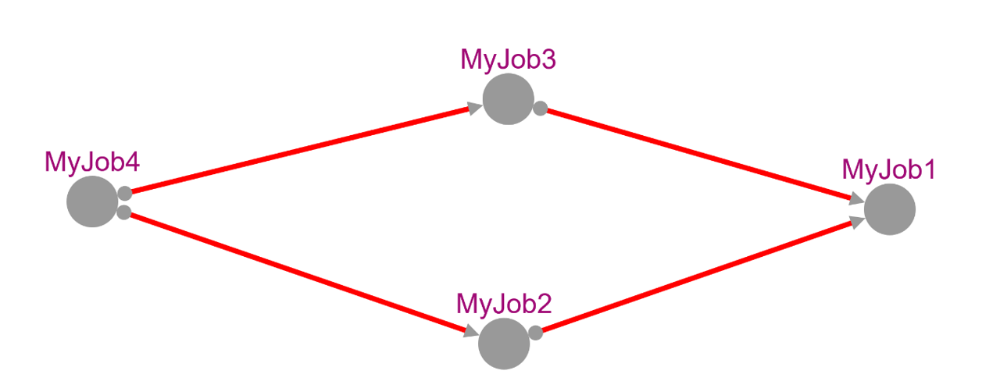

# Writing a workflow 

Developing a workflow is one of the key parts of using Slurmi. 
Here, you define the sequential steps for completing the work.
Some of these steps are dependent on each other, and these dependencies are defined in the workflow.
To do this, you first create multiple jobs.

```fsharp 
let j1 = Job ("MyJob1",[("echo",["Hello";"World"])])
let j2 = Job ("MyJob2",[("echo",["Hi";"there"])])
let j3 = Job ("MyJob3",[("echo",["Hi";";";"How are you?"])])
let j4 = Job ("MyJob4",[("echo",["Aloha"])])
```

To incorporate these tasks into the workflow, they must be transformed into a JobWithDep type, and further details need to be included.
JobInfo contains the job itself, AllOrAny specifies whether all or any of the dependencies must be satisfied, and the dependencies are specified in the JobDependency type.
Each dependency is a tuple of the job name and the number of tasks that must be completed before the job can be started.
If there are no dependencies, an empty list is used.

```fsharp
let jd1 = {JobInfo = j1; AllOrAny = TypeOfDep.All; DependingOn = []}
let jd2 = {JobInfo = j2; AllOrAny = TypeOfDep.All; DependingOn = [(j1,KindOfDependency.Afterok )]}
let jd3 = {JobInfo = j3; AllOrAny = TypeOfDep.All; DependingOn = [(j1, KindOfDependency.Afterok)]}
let jd4 = {JobInfo = j4; AllOrAny = TypeOfDep.Any; DependingOn = [(j2, KindOfDependency.Afterok);(j3, KindOfDependency.Afterok)]}
```

In the next step, the jobs are combined into a list, allowing the simultaneous editing of multiple jobs.

```fsharp 
[jd1;jd2;jd3;jd4]
|> List.map (fun x -> x.JobInfo.CommandWithArgument |> Command.SetPartition "bio-csb")

[jd1;jd2;jd3;jd4]
|> List.map (fun x -> x.JobInfo.CommandWithArgument |> Command.SetTime ({Days = None ; clock = Some {hour = 0; minute = 1; second = Some 1}}))
```

## Creating a workflow

The workflow can then be created by calling the `createWorkflow` function.

```fsharp
let resultGraph = createWorkflow [jd1;jd2;jd3;jd4]
```

## Submitting a workflow
This workflow can now be submitted to the cluster. With this, all dependencies will be resolved and submitted in the correct order. 

```fsharp
let workedOn =  new List<string>()

Runner.submitAll resultGraph.Graph.Graph workedOn 
```

## Visualisation
The workflow graph can be displayed, for example using the CyGraph library. 

```fsharp
let toFullCyGraph nodeKeyTransformer nodeDataTransformer edgeTransformer (fGraph : FGraph<_,_,_>) =
    CyGraph.initEmpty ()
    |> CyGraph.withElements [
            for (nk1,nd1,nk2,nd2,e) in FGraph.toSeq fGraph do
                let nk1s = nodeKeyTransformer nk1
                let nk2s = nodeKeyTransformer nk2
                Elements.node nk1s [CyParam.label <| nodeDataTransformer nd1]
                Elements.node nk2s [CyParam.label <| nodeDataTransformer nd2]
                Elements.edge (sprintf "%s_%s" nk2s nk1s) nk2s nk1s (edgeTransformer e)
        ]
    |> CyGraph.withStyle "node"     
        [
            CyParam.content =. CyParam.label
            CyParam.color "#A00975"
        ]
    |> CyGraph.withStyle "edge"     
        [
            CyParam.Line.color =. CyParam.color
            CyParam.Curve.style "bezier"
            CyParam.Target.Arrow.shape "triangle"
            CyParam.Source.Arrow.shape "circle"
            CyParam.color "#438AFE"
        ]
    |> CyGraph.withLayout (Layout.initCose <| Layout.LayoutOptions.Cose(ComponentSpacing = 40, EdgeElasticity = 100))
    |> CyGraph.withSize(1800, 800)


toFullCyGraph string (fun x -> x.JobInfo.Name) (fun e -> 
    [
        CyParam.label <| e.ToString()
        match e with
        | After (value) -> CyParam.color "green"
        | Afterany -> CyParam.color "turquoise"
        | Afterburstbuffer -> CyParam.color "orange"
        | Aftercorr -> CyParam.color "purple"
        | Afternotok -> CyParam.color "blue"
        | Afterok -> CyParam.color "red"
        | Singleton -> CyParam.color "hotpink"
        // | _ -> CyParam.color "black"
    ]
) resultGraph.Graph.Graph
|> CyGraph.withLayout(Layout.initCircle <| Layout.LayoutOptions.Cose())        
|> CyGraph.show
```

The Graph will look like this: 




